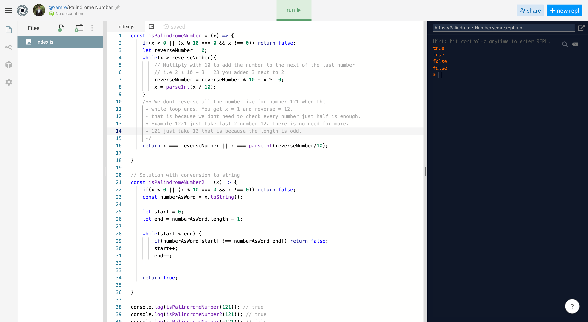

<h1 align="center">Code Challenges 👋</h1>

  
  
  
  

    
     
     
    
 

 

For this project I will be sharing coding challenges and their solutions. When you click the questions link you will be taken to site(Like leetcode) where the question asked. When you click to answer you will be taken to my personal repl page where I share my answers. Feel free to contribute by the instructions below or reaching out to me from my social media accounts.

## Usage

> To see the questions or their answer just click the links.

## Authors

👤 **Y.Emre AYBEY**

- Github: [@YemreAybey](https://github.com/YemreAybey)
- Twitter: [@YunusAybey](https://twitter.com/YunusAybey)

## 🤝 Contributing

Contributions, issues and feature requests are welcome! Feel free to check [issues page](https://github.com/YemreAybey/Challenges/issues).

1. Fork it (https://github.com/YemreAybey/Challenges/fork)
2. Create your working branch (git checkout -b [choose-a-name])
3. Commit your changes (git commit -am 'what this commit will fix/add/improve')
4. Push to the branch (git push origin [chosen-name])
5. Create a new Pull Request

## Questions and Answers

- Palindrome Number [Question](https://leetcode.com/problems/palindrome-number/) - [Answer](https://repl.it/@Yemre/Palindrome-Number).

## Show your support

Give a ⭐️ if you like this project!
